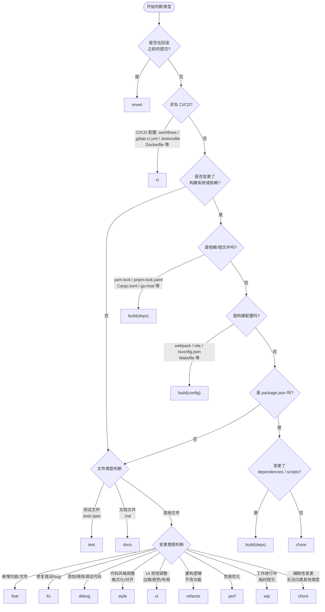

## 核心功能

1. **变更分析**：自动读取 git diff 和 git status，展示变更文件列表
2. **选择性提交**：支持用户选择提交部分文件，跳过其他文件
3. **格式强制**：提交信息必须符合 `type(scope): message` 格式
4. **Scope 校验**：scope 必须为 `mcp`、`skills`、`models`、`prompt` 之一
5. **智能询问**：当 scope 不明确时，主动询问用户确定具体 scope

## 工作流程

### 1. 检查 Git 状态
- 执行 `git status` 获取当前状态
- 检查是否有未提交的变更
- 如果没有变更，提示用户"没有需要提交的变更"

### 2. 分析变更文件
- 执行 `git diff --name-status` 获取变更文件列表
- 执行 `git diff --stat` 获取变更统计
- 将变更文件按 scope 分类：
  - `mcp/` 目录下的文件 → scope: mcp
  - `skills/` 目录下的文件 → scope: skills
  - `models/` 目录下的文件 → scope: models
  - `prompt/` 目录下的文件 或 `.prompt.md` 文件 → scope: prompt
  - 其他目录 → 需要询问用户确定 scope

### 3. 询问提交范围
- 显示所有变更文件列表
- 询问用户："要提交所有变更文件吗？还是只提交部分文件？"
- 如果用户选择部分文件，让用户指定要提交的文件
- 记录最终要提交的文件列表

### 4. 确定提交信息
#### 4.1 确定 type

按照以下流程图判断提交类型，最终输出 `type` 值：

类型说明表：

| Type | 说明 | SemVer |
|------|------|--------|
| `revert` | 回滚之前的提交 | - |
| `ci` | CI/CD 配置变更（workflows、Dockerfile 等） | - |
| `build` | 构建系统或外部依赖变更（scope: `deps` / `config`） | - |
| `chore` | 不属于其他类型的辅助性变更（文件重命名、package.json 元数据等） | - |
| `test` | 测试相关变更 | - |
| `docs` | 文档更新或修改 | - |
| `feat` | 新功能或新特性 | MINOR |
| `fix` | 修复 bug 或错误 | PATCH |
| `debug` | 添加/移除调试代码 | - |
| `style` | 代码风格调整（格式化、对齐等，不影响逻辑） | - |
| `ui` | UI 视觉样式调整（边框、颜色、布局等） | - |
| `refactor` | 代码重构（既不是修复 bug 也不是新功能） | - |
| `perf` | 性能优化 | - |
| `wip` | 工作进行中（临时提交） | - |

> **注意**： 部分场景的推荐 scope（如 `build(deps)` / `build(config)`）在流程图中已内置，实际提交时可以自行判断。

#### 4.2 确定 scope
- **Scope 选择**：
  1. 如果 4.1.1 节有推荐 scope，先显示推荐 scope
  2. 显示完整 scope 列表（带描述）
  3. 用户可以通过以下方式选择：
     - 输入数字选择（如输入 `1` 选择 `mcp`）
     - 直接输入 scope 名称（如输入 `mcp`）
     - 输入自定义 scope（如输入 `custom`）
  4. 如果用户输入自定义 scope，确认是否要使用该 scope
- **Scope 列表**（提供详细描述帮助用户选择）：
  - `mcp`: MCP 项目相关变更
  - `skills`: Skills 项目相关变更
  - `models`: Models 项目相关变更
  - `prompt`: Prompt 项目相关变更
  - 其他目录 → 需要询问用户确定 scope

#### 4.3 生成 message
- 询问用户提交信息（message）
- 确保 message 简洁明了，使用中文或英文

### 5. 执行提交
- 构建完整的提交信息：`type(scope): message`, 必要时可以补充 body 部分以添加更详细的说明
- 显示最终的提交信息供用户确认
- 如果用户确认，执行 `git add <files>` 添加选定的文件
- 执行 `git commit -m "type(scope): message"`
- 显示提交结果

### 6. 提交后操作
- 显示 `git log --oneline -5` 查看最近提交
- 询问用户是否需要推送到远程仓库